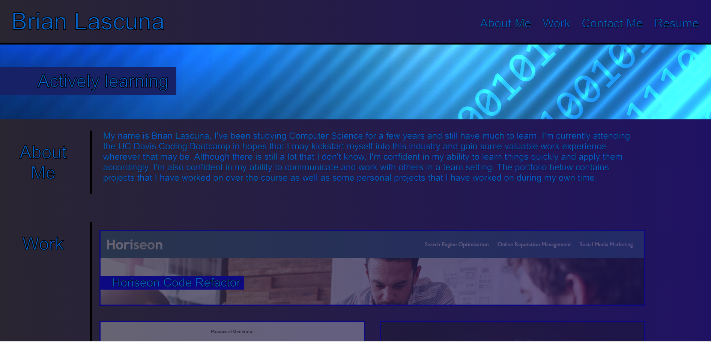

# Personal Portfolio

# Description
A personal portfolio showcasing what I've learned via projects that I have worked on across the course of the bootcamp. Built from scratch using HTML and CSS with small bit of javascript for some extra functionality. The portfolio also has been designed to be able to be viewed across multiple platforms such as tablets and smartphones.

# Usage
The portfolio can be accessed [here](https://brian-lascuna.github.io/blascuna-portfolio/).

The portfolio should look like the following:

Very straightforward in design. The nav bar within the header properly directs the user to the respective section. The cards in the work section are interactable and clicking on them will redirect to the project if it is available. The contact info on the bottom is also interactable and will allow the user to contact me if needed.

# Credits
N/A

# Licesne
N/A